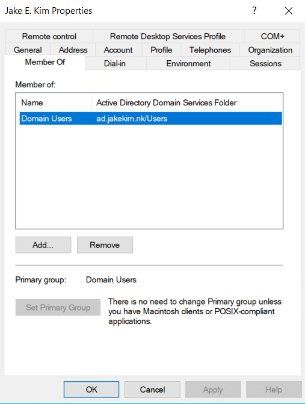
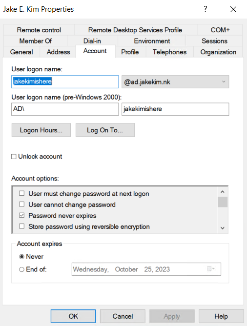
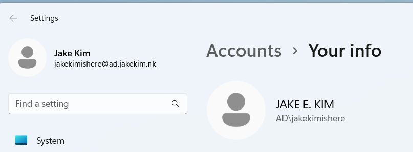

# **Homework 4 Submission**

- Name: Jake Kim
- Class: Computer and Network Security
- Date: 28 September 2023

# Task information from section #2  

# Task information from section #3 

# Task information from section #4.1

We 

# Task information from section #4.2

During

# Task information from section #4.3

Total Controls Assessed: 244

#6. Screenshot pictured below:

Screenshot 
