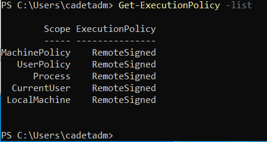

# **Homework 4 Submission**

- Name: Jake Kim
- Class: Computer and Network Security
- Date: 28 September 2023

# Task information from section #2  
From the previous lab, we were familiar with creating users (cnsinstructor) so each team member was able to create a regular user account.

# Task information from section #3 
After logging on to the newly created account, I was able to get the logon session information.

# Task information from section #4.1
The group set the execution policy on the Domain Controller (DC) to "RemoteSigned" to strike a balance between security and usability. This policy requires scripts from remote sources to be signed by trusted publishers while allowing locally authored scripts to run without signatures.

# Task information from section #4.2
I created a PowerShell script named "KimScript.ps1" that sets the location to Desktop, retrieves the current location, and echoes a message. 

# Task information from section #4.3
We downloaded the "BadBlood" project from a GitHub repository to our Active Directory Domain Controller. We then executed the "invoke-badblood.ps1" script. We were warned multiple times whether or not we wanted to proceed and after a bit of waiting they were able to create users. We were able to see changes within our Active Directory.

