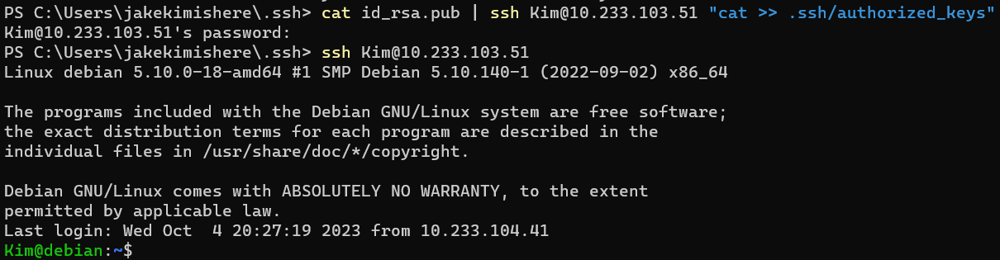

# **Homework 5 Submission**

- Name: Jake Kim
- Class: Computer and Network Security
- Date: 05 October 2023

# Task information from section #2  

In the screenshot above, root runs the w command to display information about currently logged-in users on the serverb machine. The output shows that the 'root' user is logged into the serverb machine.

In the screenshot above, the command logs into serverb remotely runs the 'hostname' command, and outputs serverb.lab.example.com without opening a shell session on serverb. 

This shows how we shared RSA SSH keys using ssh-copy-id.

The screenshot above shows the process of sharing a second SSH key to the remote machine.

# Task information from section #3 
In the Screenshot below, we created the key using ssh-keygen.

In the screenshot below, I used cat to copy send the public key direclty to the jump box from the NUC. After that, I was able to log in without having to type my password when trying to ssh into Kim@10.233.103.51.

# Task information from section #4
I was able to change the password using the passwd command and found a list of passwords that I would use for the section.

I had problems trying to run ssh-putty-brute due to our ExecutionPolicy settings but after some troubleshooting, I was able to bypass the restrictions to run the command. I used the script from putty and the list of passwords from github to brute force access into my jump box.

