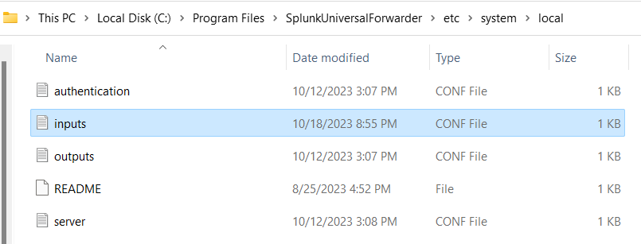

# **Homework 6 Submission**

- Name: Jake Kim
- Class: Computer and Network Security
- Date: 19 October 2023

# Intro to Splunk (eLearning) 
In the Splunk training course, Intro to Splunk, I gained a foundational understanding of key concepts and skills. Some of the different search modes I learned about include "Smart mode" with its adaptive behavior. The course covered basic syntax, pipes (|), and Boolean operations (OR, NOT) for constructing more detailed search queries. I also became more familiar with using filters like time, host, and index to limit search results effectively, with a focus on the significance of the "time" filter. I also delved into the roles and permissions within Splunk (Admin, Power, User) and their implications for user access and capabilities. The training had us take a quiz to test our knowledge and emphasized the correct definition of time zones in user settings for accurate timestamp display. I also learned more about storing and retrieving data using Splunk indexed and managing saved searches and reports. Overall, the Splunk training equipped me with a basic understanding of essential skills within Splunk. 

# Windows Event Blacklist 
I decided to choose Event ID 4624 which indicates a successful logon event. This means that the event is generated every time a user successfully logs into a computer, be it locally or through a network connection. Some of the information the logon event provides would be the user account, type of logon (interactive or network), and the source of the logon (local computer or a remote device). I choose to blacklist Event ID 4624 to reduce the volume of log data because it is generated frequently and doesn't really signify a security threat by itself. This decision would allow people to concentrate on events that are more likely to indicate potential security incidents. 

# Screenshot of input.conf in the proper file system location

