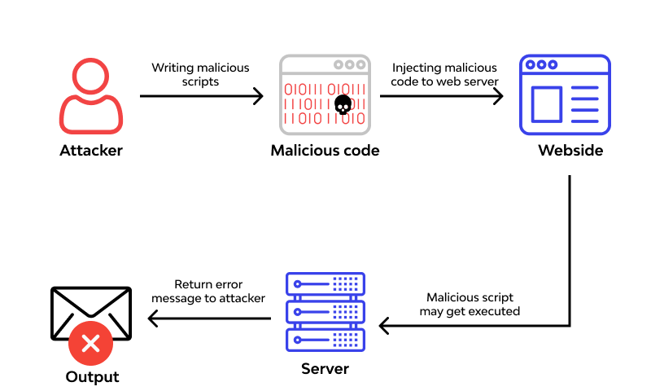

# **Homework 7 Submission**

- Name: Jake Kim
- Class: Computer and Network Security
- Date: 25 October 2023

# Exploit Name: Gitea Git Hooks Remote Code Execution (RCE)
Gitea is an open-source platform for hosting Git repositories. The exploit uses an insecure setting in Gitea 1.1.0 through 1.12.5 that allows remote code execution on the target operating system. This vulnerability comes from improper permission handling, specifically, if a user (most likely an admin) is able to create Git hooks, the module can exploit this to run any command or code of the attacker's choice. Git hooks are scripts that can run automatically in response to specific Git events. The exploit needs a temporary repository, setting up a post-receive Git hook with a payload, and triggering the hook via creating a dummy file. This would be done through the Gitea web interface. This issue was resolved in Gitea version 1.13.0, which automatically disabled the feature by default. By using Metasploit's exploit module, exploit/multi/http/gitea_git_hooks_rce, we can target vulnerabilities in Gitea's Git hooks functionality, enabling remote code execution. 

In terms of using Git hooks, an attacker can execute their own malicious code on a server hosting a Git repository. If an attacker gains control over these hooks, they can end up compromising the entire system's security by running harmful programs remotely. 

# Instructor Approval

# CWE/CVEs

