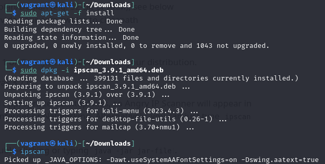
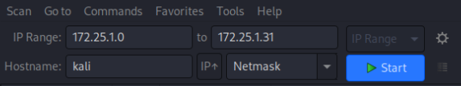
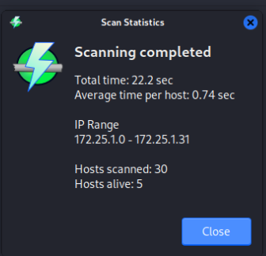
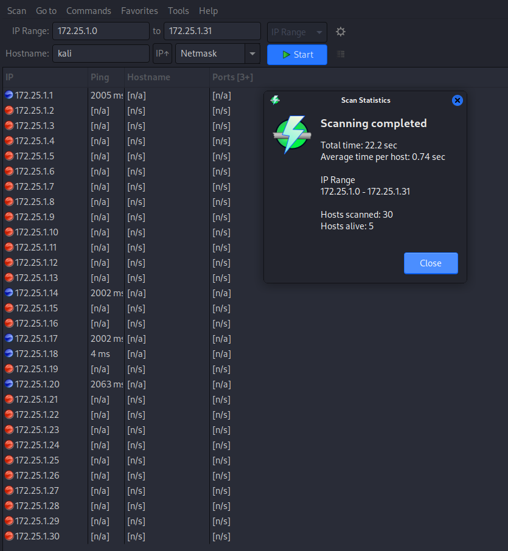

# **Homework 8 Submission**

- Name: Jake Kim
- Class: Computer and Network Security
- Date: 16 November 2023

# Research a Security Tool
I chose to use Angry IP Scanner, a lightweight and user-friendly network scanning tool built for quick and efficient host discovery on a network. Angry IP Scanner provides a straightforward graphical interface, making it accessible. The tool uses Internet Control Message Protocol (ICMP) and Transmission Control Protocol (TCP) to discover live hosts, making it effective for identifying active devices on a network. Angry IP Scanner allows users to customize scanning parameters like IP range and port specifications, facilitating targeted scans based on specific requirements. Angry IP Scanner can be acquired from its official website and is available on GitHub. By leveraging Angry IP Scanner, users can efficiently identify live hosts on a network, aiding in security assessments. 

# Demonstrate Use of the Chosen Tool
Step 1: Launch Angry IP Scanner:
Open Angry IP Scanner by typing 'ipscan' in the terminal.
Step 2: Configure Scanning Parameters
Specify the target IP range in the "IP Range" field.

Step 3: Start the Scan
Step 4: View Scan Results
The scan successfully identified live hosts on the network providing valuable information about active devices. 

